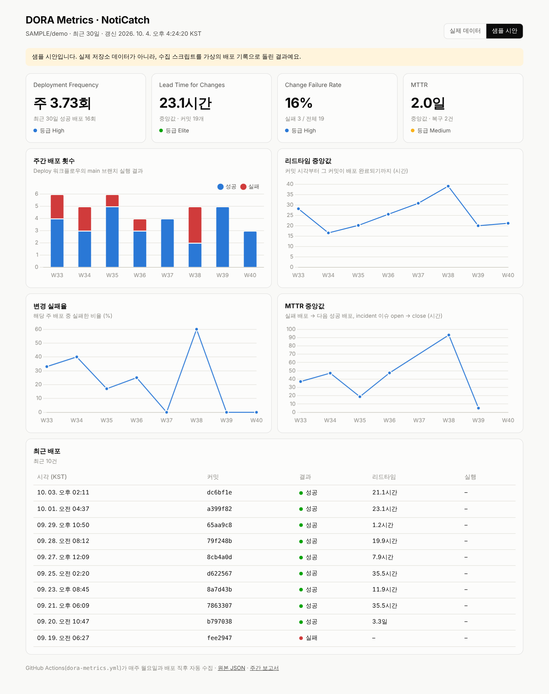

# 📢 NotiCatch — 놓치는 학교 공지가 없도록

> 흩어진 학교 공지를 한곳에 모으고, 내가 구독한 키워드가 들어간 공지만 골라 알려주는 오픈소스 서비스

| 항목 | 내용 |
|---|---|
| 과목 | OSS기반SW프로그래밍 |
| 작성자 | 김지호 (2243577) · [@03jiho](https://github.com/03jiho) |
| 라이선스 | MIT |
| 상태 | 🌱 제안 단계 (1주차) |

---

## 1. 문제 정의

### 누가, 언제, 무엇 때문에 불편한가

- **누가:** 재학생, 특히 장학금·수강신청·교환학생·채용 정보를 챙겨야 하는 학생
- **언제:** 마감이 있는 공지가 올라왔는데, 그 공지를 며칠 뒤에야(또는 마감 후에) 알게 될 때
- **왜:** 공지가 **학교 홈페이지, 단과대·학과 게시판, LMS, 학생지원 사이트** 등 여러 곳에 흩어져 있어서, 매일 모든 사이트를 직접 확인하지 않으면 놓치기 쉽다.

### 기존 방법의 한계

| 기존 방법 | 한계 |
|---|---|
| 각 사이트 직접 방문 | 매일 여러 곳을 확인해야 하고, 대부분은 나와 상관없는 공지 |
| 학교 앱 / 카톡 채널 | 전체 공지를 다 보내거나, 일부 게시판만 다룸 → 알림 피로 |
| 친구·단톡방 전달 | 운에 의존, 늦게 전달됨 |

### 사용자 검증 계획

- 2~3주차에 재학생 **5명 이상 인터뷰**와 간단한 설문(Google Form)을 진행한다.
  - 질문 예: "최근 한 학기 동안 마감을 놓친 공지가 있었나?", "공지를 주로 어디서 확인하나?", "어떤 키워드를 받고 싶나?"
- 결과를 `docs/user-research.md`에 정리하고, 기능 우선순위에 반영한다.

---

## 2. 핵심 기능 (3개)

### ① 통합 공지 수집 (플러그인형 크롤러)
- 여러 게시판의 공지를 주기적으로 수집해서 **한 화면 타임라인**으로 보여준다.
- 게시판마다 크롤러를 **플러그인 파일 하나**로 분리한다.
  → 다른 학과·학교 학생도 `crawlers/` 폴더에 파일 하나만 추가하면 기여할 수 있다. *(OSS 기여 구조)*

### ② 키워드 구독 & 알림
- 사용자가 `장학`, `근로`, `교환학생`, `인턴` 같은 키워드와 관심 게시판을 등록한다.
- 키워드에 맞는 새 공지가 올라오면 **이메일 / 웹 푸시**로 바로 알린다.
- 제외 키워드(예: `대학원`)를 지원해서 알림 피로를 줄인다.

### ③ 마감일 추출 & 캘린더 연동
- 공지 본문에서 신청 기간과 마감일을 자동으로 추출한다(정규식 → 추후 개선).
- 구독한 공지의 마감일을 **.ics 캘린더 구독 링크**로 제공한다 → Google·Apple 캘린더에 자동 반영된다.
- 마감 D-3, D-1 리마인드 알림을 보낸다.

---

## 3. 기술 스택

| 영역 | 기술 | 선택 이유 |
|---|---|---|
| 크롤러 | Python, requests, BeautifulSoup | 게시판 HTML 파싱에 가볍고 익숙함 |
| 백엔드 API | FastAPI | 빠른 개발, 자동 API 문서(Swagger) |
| DB | SQLite → PostgreSQL | 개발은 간단하게, 배포 시 확장 |
| 스케줄링 | GitHub Actions (cron) / APScheduler | 서버 없이 주기 크롤링 가능 |
| 프론트엔드 | Next.js (TypeScript) | 기존 개발 경험 활용, Vercel 배포 |
| 알림 | 이메일(SMTP), Web Push | 별도 앱 설치 없이 알림 |
| 협업·품질 | GitHub Issues/Projects, PR 리뷰, pytest, GitHub Actions CI | OSS 개발 프로세스 실습 |

---

## 4. 시스템 구조 (초안)

```
[학교 홈페이지] [학과 게시판] [LMS] ...
        │  (crawlers/ 플러그인)
        ▼
  수집기 (GitHub Actions cron, 30분 간격)
        │
        ▼
  DB (공지 · 사용자 · 구독 키워드)
        │
  ┌─────┴──────────┐
  ▼                ▼
FastAPI          알림 매처 ──▶ 이메일 / 웹 푸시
  │                └────────▶ .ics 캘린더 피드
  ▼
Next.js 웹 (타임라인 · 구독 설정)
```

---

## 5. 16주 마일스톤 (초안)

| 주차 | 단계 | 목표 / 산출물 |
|---|---|---|
| 1 | 환경 설정 | Git/GitHub·SSH 설정, 저장소 생성, 프로젝트 제안서(본 문서) |
| 2 | 사용자 조사 | 인터뷰·설문 진행, 대상 게시판 목록과 크롤링 가능 여부(robots.txt) 확인 |
| 3 | 요구사항 | 사용자 스토리, GitHub Issues·Projects 보드 구성, 라이선스·CONTRIBUTING.md |
| 4 | 설계 | DB 스키마, API 명세, 크롤러 플러그인 인터페이스 정의 |
| 5 | 크롤러 v1 | 게시판 2곳 크롤러 + 중복 제거 + 단위 테스트 |
| 6 | 백엔드 v1 | FastAPI 공지 조회 API, GitHub Actions 주기 수집 |
| 7 | 프론트 v1 | Next.js 통합 공지 타임라인, 검색 |
| 8 | **중간 점검** | MVP 데모(기능 ①), 중간 발표 |
| 9 | 구독 | 회원(이메일) 등록, 키워드·제외 키워드·게시판 구독 |
| 10 | 알림 | 키워드 매칭 → 이메일 알림, 알림 로그 |
| 11 | 웹 푸시 | Web Push 알림, 알림 설정 화면 |
| 12 | 마감일 | 마감일 추출, .ics 캘린더 피드, D-1·D-3 리마인드 |
| 13 | 확장·기여 | 크롤러 5곳 이상으로 확장, 외부 기여 가이드·이슈 템플릿 |
| 14 | 사용자 테스트 | 재학생 베타 테스트(5명 이상), 피드백 반영 |
| 15 | 안정화 | 버그 수정, 테스트 커버리지, 문서화, 배포 |
| 16 | **최종 발표** | 최종 데모, 회고, v1.0 릴리스 태그 |

> 2학기로 이어서 진행한다면: 다른 학교 플러그인 지원, 공지 요약(LLM), 모바일 PWA를 추가할 계획이다.

---

## 6. 오픈소스 운영 계획

- **라이선스:** MIT
- **기여 방법:** `CONTRIBUTING.md`에 크롤러 플러그인 추가 방법을 단계별로 안내하고, `good first issue` 라벨을 운영한다.
- **브랜치 전략:** `main`(배포) / `feat/*` → PR → 리뷰 후 병합
- **윤리·법적 고려:** robots.txt와 이용약관을 준수하고, 요청 간격을 제한하며, 공지는 원문 링크 중심으로 제공한다(본문 전체 재배포 X).

---

## 7. 1주차 개발 환경 설정 기록

- [x] GitHub 계정 확인 (`03jiho`)
- [x] 저장소 생성 (MIT 라이선스) 및 제안서 첫 커밋
- [x] Git 설치 및 사용자 정보 설정 (`git config --global user.name / user.email`)
- [x] SSH 키 생성(ed25519) 및 GitHub 등록, `ssh -T git@github.com` 인증 확인
- [x] SSH로 clone → 로컬 커밋 & 푸시

---

## 8. 2주차: DORA 메트릭 자동 수집

GitHub Actions로 DORA 4대 지표를 자동으로 모으고, 대시보드와 주간 보고서로 보여준다.

- **대시보드:** https://03jiho.github.io/noticatch/ (샘플 시안: [`?demo=1`](https://03jiho.github.io/noticatch/?demo=1))
- **최신 주간 보고서:** [`reports/LATEST.md`](reports/LATEST.md) · **원본 JSON:** [`metrics/dora-latest.json`](metrics/dora-latest.json)

### 구성

| 파일 | 역할 |
|---|---|
| [`.github/workflows/deploy-pages.yml`](.github/workflows/deploy-pages.yml) | `main`에 push되면 대시보드를 GitHub Pages로 배포. DORA에서 말하는 "배포"의 기준 |
| [`.github/workflows/dora-metrics.yml`](.github/workflows/dora-metrics.yml) | 매주 월요일 09:00(KST), 배포 직후, incident 이슈 종료 시 지표 수집 → JSON 아티팩트 업로드 → 보고서·README 자동 커밋 |
| [`scripts/dora_metrics.py`](scripts/dora_metrics.py) | GitHub REST API로 배포 기록·커밋·이슈를 읽어 지표 계산 (표준 라이브러리만 사용) |
| [`dashboard/index.html`](dashboard/index.html) | Chart.js 대시보드. 최신 JSON을 읽어서 그림 |

### 지표 정의

| 지표 | 이 저장소에서의 계산 방법 |
|---|---|
| Deployment Frequency | 최근 30일 동안 `Deploy` 워크플로우가 `main`에서 성공한 횟수 (주당 환산) |
| Lead Time for Changes | 배포에 새로 포함된 각 커밋의 커밋 시각 → 배포 완료 시각, 중앙값 |
| Change Failure Rate | 실패한 배포 / 전체 배포 (취소된 실행 제외) |
| MTTR | ① 실패한 배포 → 다음 성공 배포, ② `incident` 라벨 이슈 open → close, 둘을 합친 중앙값 |

등급(Elite/High/Medium/Low)은 DORA 보고서의 구간을 단순화한 참고용이다. 자동 갱신 커밋(`[skip ci]`)은 리드타임 계산에서 뺀다.

### 현재 지표 (자동 갱신)

<!-- DORA:START -->
_아직 수집 전. `DORA Metrics` 워크플로우가 처음 실행되면 이 자리에 표가 채워진다._
<!-- DORA:END -->

### 대시보드

샘플 시안 (가상의 배포 기록으로 수집 스크립트를 돌린 결과. 실제 데이터가 쌓이기 전 화면 구성을 보여주기 위한 용도):



---

## 9. AI 활용 공개

본 과제는 생성형 AI의 도움을 받아 수행했으며, 수업 AI 활용 정책에 따라 아래와 같이 공개한다.

| 항목 | 내용 |
|---|---|
| 도구 | Claude (Anthropic) — Claude 데스크톱 앱 Cowork 모드, Claude in Chrome 브라우저 연동 |
| 사용 일시 | 2026년 10월 4일 (1·2주차) |
| 사용자 | 김지호 (2243577) |

### 입력 프롬프트 (요지 정리)

1. 1주차 과제 공지 전문을 붙여넣고 "OSS기반SW프로그래밍 과목 과제야"라며 과제 수행 도움을 요청
2. "소프트웨어공학 팀 프로젝트와 같은 주제로 해도 될까, 아니면 새 주제를 추천받을까? 교수님은 내가 좋아하는 것 말고 사용자 입장에서 필요한 것을 만들라고 하셨어."
3. "추천받은 주제 중 1번(학교 공지 키워드 알림)과 3번(고령자 키오스크 연습 앱) 중 어느 쪽이 나을까?"
4. "어르신 사용자 테스트가 어려우니 1번으로 하자."
5. "Claude와 연동된 크롬 탭에 GitHub를 열어놨으니 직접 조작해서 저장소 생성과 제안서 업로드를 해줘."
6. "SSH 키 설정과 푸시도 진행해줘."
7. "AI 활용 공개 내용을 정리해서 추가해줘."
8. "프로필 README는 이모지 빼고 사람이 쓴 것처럼 다시 써줘. 컴퓨터공학과이고 AI 에이전트를 활용한 바이브코딩에 관심 있다고 정리해줘." (1주차 선택 과제)
9. 2주차 과제 공지(DORA 메트릭 수집 자동화) 전문을 붙여넣고 수행 도움을 요청

### 활용 범위

| 작업 | AI 수행 | 본인 수행 |
|---|---|---|
| 주제 선정 | 후보 4개 제안, 1번·3번 장단점 비교 | 교수님 기준을 제시하고 최종 주제(1번) 결정 |
| 제안서(README) | 문제정의·핵심 기능·기술 스택·16주 마일스톤 초안 작성 | 내용 검토 및 제출 확정 |
| 저장소 생성 | 브라우저 조작으로 `noticatch` 저장소 생성(MIT), README 첫 커밋 | 생성 설정 확인·승인 |
| SSH 설정 | 명령어 안내, 공개키를 GitHub에 등록하는 양식 입력 | Git Bash에서 키 생성·명령 실행, GitHub 본인 인증(sudo) 승인 |
| clone·커밋·푸시 | 명령어 안내 | 로컬에서 직접 실행 (`f50a835`) |
| Profile README | 초안 작성, 웹 편집기로 `03jiho/03jiho` 저장소에 커밋 | 학과·관심 분야 제시, 문체 수정 요청 |
| 2주차 DORA | 수집 스크립트·워크플로우·대시보드 작성, 가상 데이터로 로직 테스트, 샘플 화면 캡처 | 저장소 위치·진행 방식 결정, 로컬에서 커밋·푸시, Pages 설정 승인 |

### 정보 검증

- SSH 연결은 `ssh -T git@github.com` 실행 결과(`Hi 03jiho! You've successfully authenticated`)로 확인했다.
- 푸시 결과는 GitHub 커밋 기록에서 확인했다.
- 제안서에 들어간 기술 스택과 일정은 AI가 만든 초안이므로, 실제 구현 가능성과 학교 게시판의 크롤링 허용 여부(robots.txt·이용약관)는 2주차 사용자 조사 단계에서 직접 확인할 예정이다.
- 문제정의에 실제 사용자 수치는 넣지 않았다. 근거 데이터는 인터뷰·설문 결과로 채울 예정이다.
