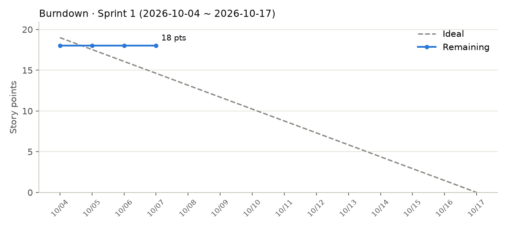
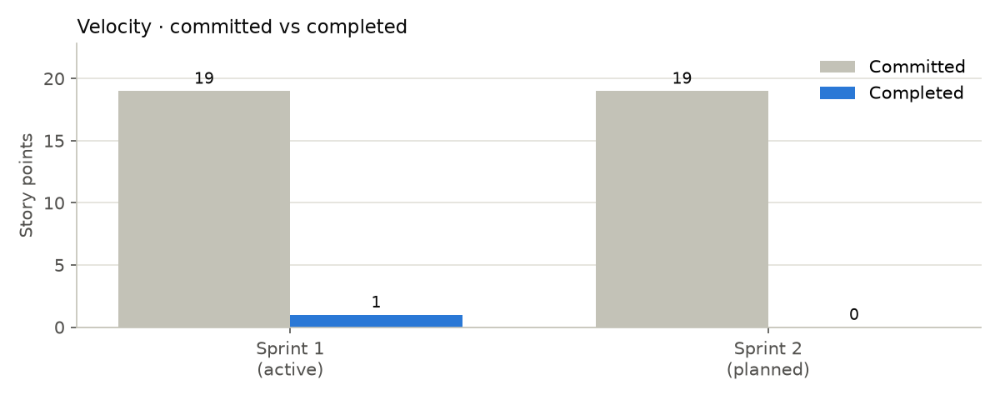

# 스프린트 분석 보고서

- 생성: 2026-10-07 04:55 KST (GitHub Actions 자동 생성)
- 현재 스프린트: Sprint 1 · 요구사항·설계
- Velocity: 1 pts (진행 중 스프린트의 현재까지 완료분)
- Cycle Time 중앙값: 0.1시간 (완료 이슈 1개)

## 스프린트별

| 스프린트 | 기간 | 상태 | 이슈 (완료/전체) | 포인트 (완료/계획) | Cycle Time 중앙값 |
|---|---|---|---|---|---|
| Sprint 1 · 요구사항·설계 | 2026-10-04 ~ 2026-10-17 | 진행 중 | 1/9 | 1/19 | 0.1시간 |
| Sprint 2 · 크롤러·API v1 | 2026-10-18 ~ 2026-10-31 | 예정 | 0/6 | 0/19 | - |

## 완료된 이슈의 Cycle Time

| 이슈 | 포인트 | Cycle Time | Lead Time | 종료 (KST) |
|---|---|---|---|---|
| #4 Issue/PR 템플릿과 라벨 체계 구성 | 1 | 0.1시간 | 0.2시간 | 10-04 16:59 |

## 정의

- **Velocity**: 스프린트(마일스톤) 안에서 닫힌 이슈의 스토리 포인트(`size: N` 라벨) 합
- **Burndown**: 스프린트 시작일부터 날짜별 남은 포인트. 점선은 이상적인 감소선
- **Cycle Time**: 담당자 지정(작업 시작) → 이슈 종료. 담당자가 없으면 생성 시각부터
- **Lead Time**: 이슈 생성 → 종료
